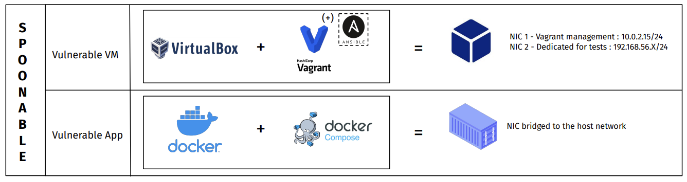
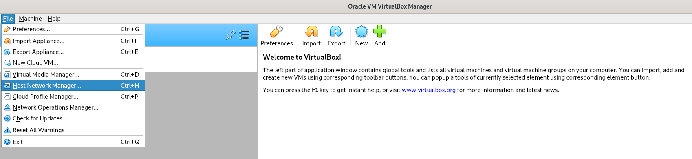
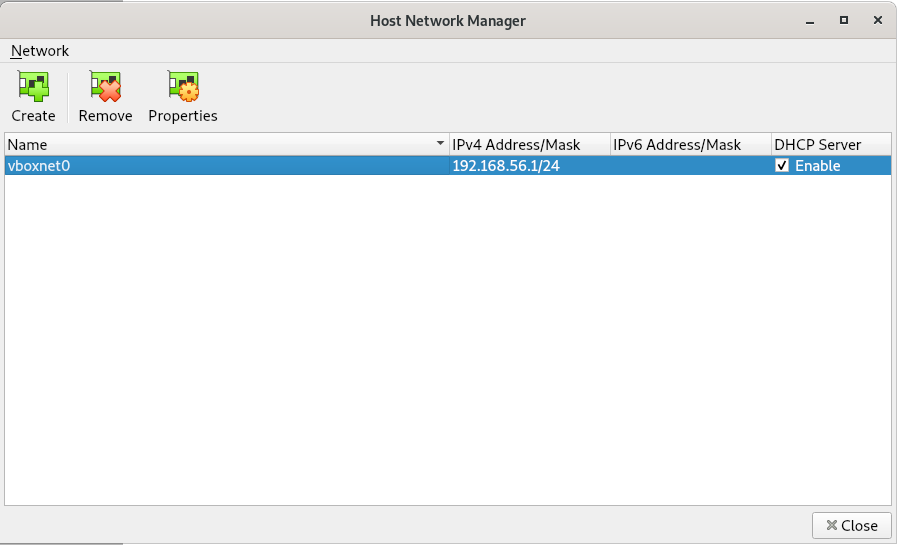
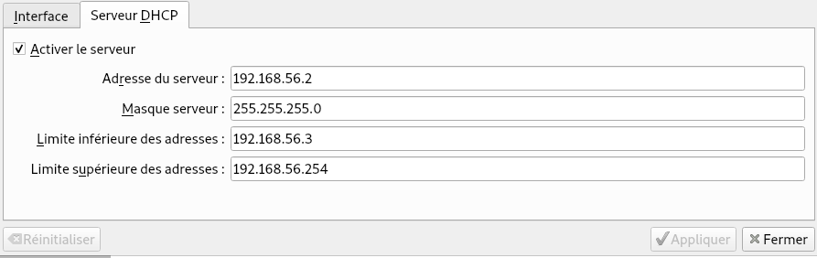
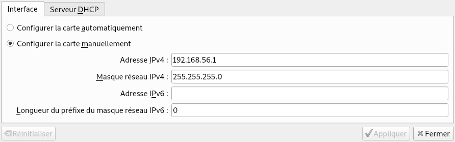
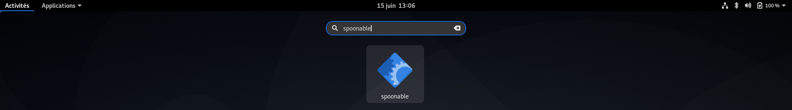
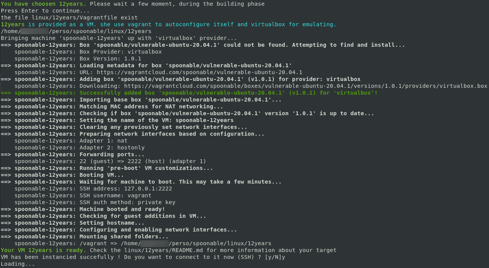
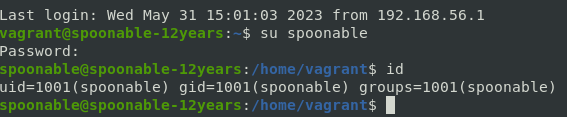

# spoonable 


<p align="center">
  
</p>

```
                                    _     _      
                                   | |   | |     
  ___ _ __   ___   ___  _ __   __ _| |__ | | ___ 
 / __| '_ \ / _ \ / _ \| '_ \ / _` | '_ \| |/ _ \
 \__ \ |_) | (_) | (_) | | | | (_| | |_) | |  __/
 |___/ .__/ \___/ \___/|_| |_|\__,_|_.__/|_|\___|
     | |                                         
     |_|                                         

Pentesting environment "On premise" for a workstation - github.com/archidote

            
Select an option :
0  - windows
1  - linux
2  - applications
3  - Vagrant lab manager
4  - Docker container lab manager
5  - Install/Launch Kali
6  - Update
q  - quit
```
## What is the aim of this project ? 


## How spoonable works ? - Schema 



# How to setup it ?

## Core Dependencies : 

### My versions of these tools : 

- Virtualbox 6.1
- Vagrant 2.3.4 
- Ansible 2.13.4 
- Docker 20.10.21

First of all, install on your host the last vagrant version from the official website (apt packages are not synchronize with the last version unfortunatly)

https://developer.hashicorp.com/vagrant/downloads

afterthat, please install the following component with apt : 

``` 
sudo apt update
sudo apt install virtualbox ansible docker-ce docker-compose
```
## Configure a dedicated virtual interface  into virtualbox 

<b>If this is not already the case for virtualbox</b>, configure a dedicated virtual interface with the following name : <b>vboxnet0</b> 

Go to <b>File</b> -> <b>Host Network Manager </b>



And then click on <b>create</b> to add the virtual interface vboxnet0. don't forget to <b> enable DHCP server </b> : 



> WARNING : 
> In order not to have to make too many changes (on the network settings side), choose the following IP range for the <b>vboxnet0</b> virtual interface: 
> - IPv4 Adress/Mask : 192.168.56.1/24
> - IPv6 Adress/Mask : Leave empty 
> - DHCP Server : Enabled 

> Below, here are all the network parameters associated with the vboxnet0 card. Please make sure that the settings are the same on your side to avoid any communication problems especially for windows labs




That's it for the prerequisites  

# Install spoonable
```
git clone https://github.com/archidote/spoonable 
cd spoonable 
```
## From the project 
```
python3 spoonable.py
``` 
## From everywhere (terminal)

``` 
chmod u+x run.sh
sudo ln -s "$(pwd)/run.sh" "/usr/local/bin/spoonable"
``` 

And then, you can call the spoonable command from everywhere. 

## From your "startup manu" 

```
cd ~ 
nano spoonable.desktop
```

```
[Desktop Entry]
Name=spoonable
Comment=spoonable
Exec=/usr/local/bin/spoonable
Type=Application
Terminal=true
Categories=System;GTK;Utility;
```

Logout from your session and login back. 




# Demo - How spoonable work ? 

spoonable is an open source project that aims to provide different test environments (dedicated applications, operating systems) to easily test and exploit some known vulnerabilities. 

Let's take the following case: 

If I want to test the pwnkit vulnerability, I just need to perform the following actions:

```
                                    _     _      
                                   | |   | |     
  ___ _ __   ___   ___  _ __   __ _| |__ | | ___ 
 / __| '_ \ / _ \ / _ \| '_ \ / _` | '_ \| |/ _ \
 \__ \ |_) | (_) | (_) | | | | (_| | |_) | |  __/
 |___/ .__/ \___/ \___/|_| |_|\__,_|_.__/|_|\___|
     | |                                         
     |_|                                         

Pentesting environment "On premise" for a workstation - github.com/archidote

            
Select an option :
0  - windows
1  - linux
2  - applications
3  - Vagrant lab manager
4  - Docker container lab manager
5  - Install/Launch Kali
6  - Update
q  - quit
 >> 1
```

```
Select your vuln among the following list : 

0  - 12years
1  - dare-to-have-rights
2  - docker-host-misconfiguration
3  - docker-host-misconfiguration-2
4  - docker-registry-misconfiguration
5  - dosu
6  - epipytrid
7  - he-should-have-removed-this
8  - siuuuuuud
b  - back
 >> 0
```



While the download progresses, check out the file: <code>{ENVIRONMENT}/
pwnkit/README.md</code>

So here the correct path would be: <code> linux/pwnkit/README.md</code> because we are testing the "pwnkit" vulnerability that impacts the Linux family of open source operating systems.



> Post Exploitation only : If you accidentally close your terminal with an SSH session connected to a VM. Here's how to proceed, to reconnect to the target using SSH. <br>
> <code>user@ubuntu:~$ cd {env}/{vuln}/ # Generic example </code> <br>
> <code>user@ubuntu:~$ cd linux/12years/ </code> <br>
> <code>user@ubuntu:~$ vagrant ssh </code> <br>
> <code>vagrant@spoonable-12years:~$ su spoonable  </code> <br>

# Advices 

- Spoonable only needs the internet to retrieve large vulnerable artifacts. Make sure you are on a good wired/wireless network, so you don't lose too much time to start your tests. 
  
- If you want to take notes about the differents challenge, please use an other directory than spoonable/ in order to avoid problem id you update it. 
-  Spoonable doesn't need sudo by défault (only when he manage vulnerable <b>VM</b>). However, when using vulnerable containers, sudo pre-command becomes necessary. 

# Default credentials 

- Linux Based Machines : 
  - id : spoonable
  - password : spoonable 

- Windows Bases Machines : 
  - Normal AD user : spoonable 
  - password : spoonable123!

# Recommandation 

Using the embedded version of kalilinux in spoonable is not mandatory. You can use your own. However, it must be able to communicate with the spoonable lab VMs. (add the vboxnet0 network card). 

Otherwise, you can use [exegol](https://github.com/ThePorgs/Exegol) which is a fully featured hacking environment container (docker<3)